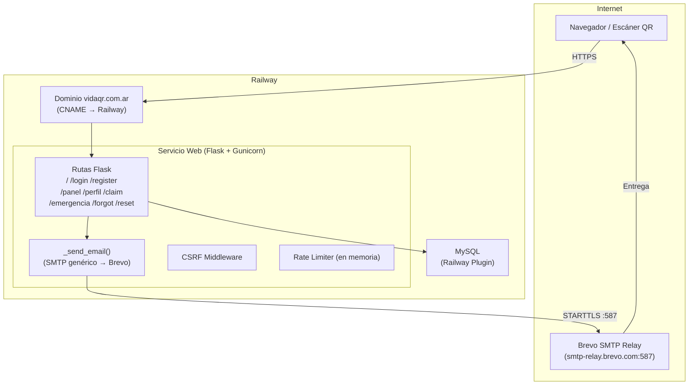
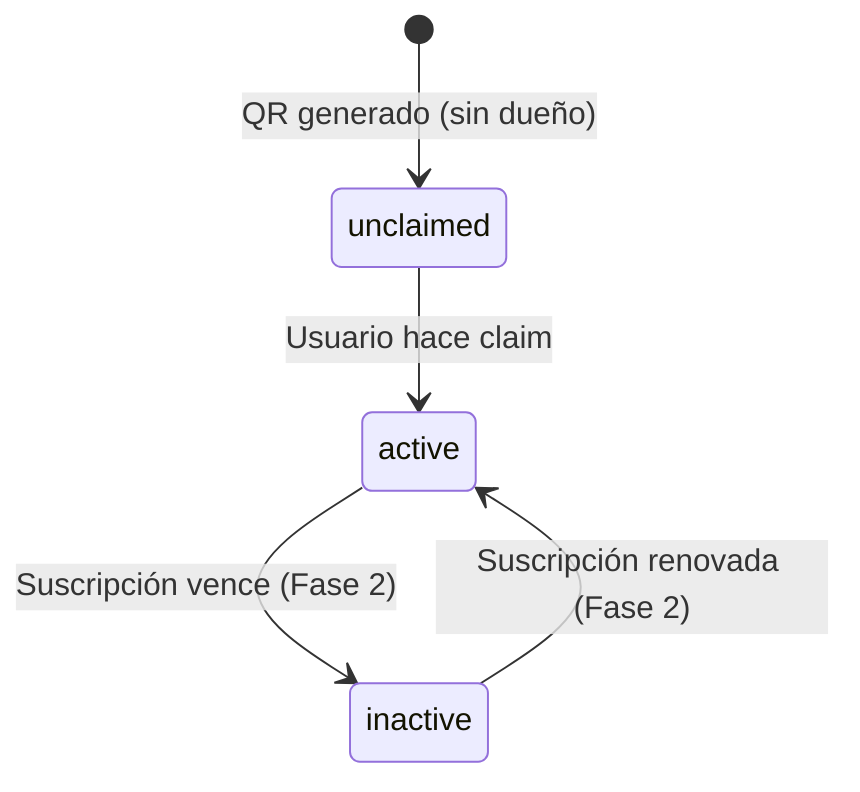

# Diseño Técnico — VidaQR Fase 1

## Visión General

VidaQR Fase 1 consolida la base operativa del producto sobre el código existente en Flask + MySQL desplegado en Railway. El alcance técnico cubre cuatro áreas:

1. **Infraestructura**: dominio propio (`vidaqr.com.ar`) con SSL, variables de entorno correctamente gestionadas y health checks.
2. **Email transaccional**: integración con Brevo vía SMTP relay para emails de bienvenida y reset de contraseña.
3. **Página de inicio pública**: landing page en `/` que reemplaza el redirect actual al login.
4. **Preparación Fase 2**: columna `status` en `qr_codes` y estructura de rutas que no bloquee la monetización futura.

El código base ya implementa autenticación, perfil médico, claim de QR, ficha pública de emergencia, CSRF y rate limiting. Este diseño describe únicamente los cambios y adiciones necesarios para cumplir los requisitos de Fase 1.

---

## Arquitectura

La arquitectura no cambia respecto al estado actual. Se trata de una aplicación monolítica Flask con renderizado server-side (Jinja2), base de datos MySQL en Railway, y Gunicorn como servidor WSGI.



**Decisiones de arquitectura:**

- **Sin nuevas dependencias**: Brevo funciona con el módulo `smtplib` estándar de Python. No se agrega ningún SDK de Brevo.
- **Sin workers asíncronos**: el envío de email ocurre de forma síncrona en el request. El timeout de Gunicorn es 60 s, suficiente para SMTP. Si el envío falla, el flujo continúa (ver Requisito 2.4).
- **Sin caché de sesiones externo**: el rate limiter en memoria es suficiente para Fase 1 con 1 worker. Si se escala a múltiples workers en Fase 2, se deberá migrar a Redis.

---

## Componentes e Interfaces

### 1. Módulo de Email (`app.py` — función `_send_email`)

La función `_send_reset_email` existente se generaliza en una función `_send_email` que acepta destinatario, asunto, cuerpo texto y cuerpo HTML. Esto permite reutilizarla tanto para el reset como para la bienvenida.

```python
def _send_email(to_email: str, subject: str, text_body: str, html_body: str) -> bool:
    """
    Envía un email vía SMTP relay (Brevo).
    Retorna True si se envió, False si no hay config o hubo error.
    Si no hay config, imprime el contenido en los logs (modo dev).
    """
```

**Variables de entorno requeridas:**

| Variable        | Descripción                                  | Ejemplo (Brevo)                  |
|-----------------|----------------------------------------------|----------------------------------|
| `MAIL_SERVER`   | Host SMTP de Brevo                           | `smtp-relay.brevo.com`           |
| `MAIL_PORT`     | Puerto SMTP (STARTTLS)                       | `587`                            |
| `MAIL_USERNAME` | Login SMTP de Brevo (email de la cuenta)     | `tu@email.com`                   |
| `MAIL_PASSWORD` | API Key de Brevo (usada como contraseña SMTP)| `xsmtpsib-...`                   |
| `MAIL_FROM`     | Dirección remitente visible                  | `noreply@vidaqr.com.ar`          |
| `APP_BASE_URL`  | URL base para construir enlaces en emails    | `https://vidaqr.com.ar`          |

### 2. Email de Bienvenida

Se agrega la función `_send_welcome_email(to_email, nombre)` que construye el contenido y llama a `_send_email`.

**Contenido requerido:**
- Nombre del producto: VidaQR
- Saludo personalizado con el nombre del usuario (si fue proporcionado)
- Enlace directo al panel: `{APP_BASE_URL}/panel`
- Mención al proceso de obtención de etiquetas físicas (preparación Fase 2)
- Versión texto plano + versión HTML

**Punto de invocación**: al final del flujo de registro exitoso en la ruta `/register`, antes del redirect.

### 3. Email de Reset (refactorización)

La función `_send_reset_email` existente se reemplaza por una llamada a `_send_email` con el contenido actualizado que incluye la marca VidaQR.

**Contenido requerido:**
- Nombre del producto: VidaQR
- Enlace de reset: `{APP_BASE_URL}/reset/<token>`
- Advertencia de expiración en 1 hora
- Aclaración de que puede ignorarse si no se solicitó

### 4. Página de Inicio (`/`)

Se crea el template `templates/index.html` y se modifica la ruta `/` en `app.py`.

**Lógica de la ruta:**
```python
@app.route("/")
def home():
    if get_current_user():
        return redirect(url_for("panel"))
    return render_template("index.html")
```

**Secciones del template:**
1. **Hero**: nombre VidaQR, tagline, CTA principal → `/register`
2. **Cómo funciona**: 3 pasos (Comprá tu etiqueta → Completá tu ficha → Pegala)
3. **Casos de uso**: individuos, ciclistas, motociclistas, deportistas, adultos mayores
4. **Cómo obtener tu etiqueta** (Fase 2 preview): descripción del proceso de compra futuro, sin precios definitivos
5. **Navegación**: enlace a `/login` para usuarios existentes
6. **Meta Open Graph**: `og:title`, `og:description`, `og:image`

### 5. Migración de base de datos — columna `status` en `qr_codes`

Se agrega la columna `status` a la tabla `qr_codes` mediante la función `_ensure_qr_status_column()`, que se ejecuta al arrancar la app (igual que `_ensure_profile_columns`).

```sql
ALTER TABLE qr_codes ADD COLUMN status ENUM('unclaimed','active','inactive') NOT NULL DEFAULT 'unclaimed';
```

La columna se inicializa con:
- `'unclaimed'` para QRs sin `user_id`
- `'active'` para QRs con `user_id` (ya reclamados)

### 6. Infraestructura — Variables de entorno y documentación

Se crea el archivo `.env.example` en la raíz del repositorio con todas las variables requeridas documentadas.

Se agrega la advertencia de `FLASK_SECRET` por defecto en los logs al arrancar si la variable no está definida.

---

## Modelos de Datos

### Tabla `users` (sin cambios en Fase 1)

| Columna           | Tipo           | Descripción                              |
|-------------------|----------------|------------------------------------------|
| `id`              | INT PK         | Identificador único                      |
| `email`           | VARCHAR(255)   | Email del usuario (único)                |
| `password_hash`   | VARCHAR(255)   | Hash bcrypt de la contraseña             |
| `nombre`          | VARCHAR(100)   | Nombre (perfil médico)                   |
| `apellido`        | VARCHAR(100)   | Apellido (perfil médico)                 |
| `grupo_sanguineo` | VARCHAR(10)    | Grupo sanguíneo                          |
| `alergias`        | VARCHAR(255)   | Alergias conocidas                       |
| `contacto1`       | VARCHAR(40)    | Teléfono contacto de emergencia 1        |
| `contacto2`       | VARCHAR(40)    | Teléfono contacto de emergencia 2        |
| `reset_token`     | VARCHAR(64)    | Token de reset de contraseña             |
| `reset_expires`   | DATETIME       | Expiración del token de reset            |

### Tabla `qr_codes` (se agrega columna `status`)

| Columna      | Tipo                                        | Descripción                              |
|--------------|---------------------------------------------|------------------------------------------|
| `id`         | INT PK                                      | Identificador interno                    |
| `public_code`| VARCHAR(64) UNIQUE                          | Código público impreso en la etiqueta    |
| `user_id`    | INT FK → users.id (nullable)                | Propietario del QR (NULL = sin reclamar) |
| `claimed_at` | DATETIME (nullable)                         | Fecha de claim                           |
| `status`     | ENUM('unclaimed','active','inactive')       | Estado del QR para Fase 2               |

**Invariante**: `status = 'unclaimed'` ↔ `user_id IS NULL`. Esta invariante se mantiene en el código de claim.

### Flujo de estados del QR



---

## Propiedades de Corrección

*Una propiedad es una característica o comportamiento que debe ser verdadero en todas las ejecuciones válidas del sistema — esencialmente, una declaración formal sobre lo que el sistema debe hacer. Las propiedades sirven como puente entre las especificaciones legibles por humanos y las garantías de corrección verificables por máquinas.*

### Propiedad 1: El email usa la dirección remitente configurada

*Para cualquier* dirección de email válida configurada en `MAIL_FROM`, todos los emails enviados por la aplicación (bienvenida y reset) deben usar esa dirección como remitente (`From` header).

**Valida: Requisitos 2.6**

---

### Propiedad 2: El email de bienvenida contiene todos los elementos requeridos

*Para cualquier* combinación de nombre de usuario y dirección de email válidos, el email de bienvenida generado debe contener: el nombre del producto "VidaQR", un saludo que incluya el nombre del usuario (si fue proporcionado), un enlace al panel (`/panel`), y una mención al proceso de obtención de etiquetas físicas. Tanto la versión texto plano como la versión HTML deben contener estos elementos.

**Valida: Requisitos 2.2, 2.3, 6.4**

---

### Propiedad 3: El email de reset contiene todos los elementos requeridos y el token correcto

*Para cualquier* token de reset válido y dirección de email, el email de reset generado debe contener: el nombre del producto "VidaQR", el token en la URL del enlace de reset, una advertencia de expiración en 1 hora, y una aclaración de que puede ignorarse. Tanto la versión texto plano como la versión HTML deben contener estos elementos.

**Valida: Requisitos 3.2, 3.3, 3.4**

---

### Propiedad 4: Los tokens de reset son únicos y suficientemente largos

*Para cualquier* par de solicitudes de reset de contraseña, los tokens generados deben ser distintos entre sí y tener una longitud de al menos 32 bytes cuando se decodifican de base64url.

**Valida: Requisito 3.1**

---

### Propiedad 5: El token de reset se invalida tras el uso exitoso

*Para cualquier* token de reset válido, después de que el usuario completa exitosamente el cambio de contraseña, el token debe ser `NULL` en la base de datos (no reutilizable).

**Valida: Requisito 3.7**

---

### Propiedad 6: La respuesta de /forgot es idéntica para emails registrados y no registrados

*Para cualquier* dirección de email (registrada o no), la respuesta HTTP de `POST /forgot` debe ser idéntica en contenido y código de estado, de forma que no sea posible distinguir si el email existe en el sistema.

**Valida: Requisito 3.8**

---

### Propiedad 7: La URL base configurable se refleja en todos los enlaces de email

*Para cualquier* URL base válida configurada en `APP_BASE_URL`, todos los enlaces generados en emails (reset de contraseña, panel en bienvenida) deben comenzar con esa URL base.

**Valida: Requisitos 5.2**

---

### Propiedad 8: La ruta / redirige a /panel para usuarios autenticados

*Para cualquier* usuario con sesión activa válida, una solicitud GET a `/` debe resultar en un redirect a `/panel`, independientemente del contenido de la sesión.

**Valida: Requisito 4.8**

---

### Propiedad 9: La invariante status/user_id se mantiene tras el claim

*Para cualquier* QR en estado `unclaimed` (con `user_id IS NULL`), después de que un usuario realiza el claim, el QR debe tener `status = 'active'` y `user_id` igual al ID del usuario que realizó el claim.

**Valida: Requisito 6.1**

---

## Manejo de Errores

### Errores de SMTP / Email

| Escenario                              | Comportamiento                                                                 |
|----------------------------------------|--------------------------------------------------------------------------------|
| SMTP no configurado (vars vacías)      | Log del contenido del email en consola. Flujo continúa normalmente.            |
| Error de conexión SMTP                 | Log del error con `[ERROR] _send_email: ...`. Flujo continúa normalmente.      |
| Autenticación SMTP fallida             | Log del error. Flujo continúa. No se muestra error al usuario.                 |
| Email de bienvenida falla              | El registro se completa. El usuario llega al panel/perfil normalmente.         |
| Email de reset falla                   | El token se guarda en DB. El usuario ve "te enviamos instrucciones" igualmente. |

**Principio**: los errores de email nunca bloquean el flujo principal del usuario.

### Errores de base de datos

| Escenario                              | Comportamiento                                                                 |
|----------------------------------------|--------------------------------------------------------------------------------|
| Conexión falla al arrancar             | Log del error. Las rutas que requieren DB devuelven HTTP 503.                  |
| Conexión falla durante un request      | Excepción propagada → Flask devuelve HTTP 500. Log automático de Railway.      |
| Migración de columna falla             | Log con `[WARN]`. La app arranca igual; la columna se intentará agregar en el próximo restart. |

### Errores de configuración

| Escenario                              | Comportamiento                                                                 |
|----------------------------------------|--------------------------------------------------------------------------------|
| `FLASK_SECRET` no definida             | Se usa el valor de fallback `"change-me-in-prod"`. Se registra `[WARN]` en logs. |
| `APP_BASE_URL` no definida             | Se usa `"http://localhost:5000"` como fallback. Los enlaces en emails apuntarán a localhost. |

### Tokens de reset

| Escenario                              | Comportamiento                                                                 |
|----------------------------------------|--------------------------------------------------------------------------------|
| Token no existe en DB                  | Se muestra `reset_password.html` con `invalid=True`.                           |
| Token expirado (> 1 hora)              | Se muestra `reset_password.html` con `invalid=True`.                           |
| Token ya usado (NULL en DB)            | Se muestra `reset_password.html` con `invalid=True`.                           |

---

## Estrategia de Testing

### Enfoque dual

Se combinan tests de ejemplo (unitarios) con tests basados en propiedades para lograr cobertura completa.

**Tests de ejemplo** cubren:
- Escenarios específicos con datos concretos
- Casos de error y edge cases
- Integración entre componentes

**Tests de propiedades** cubren:
- Comportamiento universal que debe sostenerse para cualquier input válido
- Generación automática de casos de prueba (mínimo 100 iteraciones por propiedad)

### Librería de property-based testing

Se usa **[Hypothesis](https://hypothesis.readthedocs.io/)** (Python), la librería estándar de PBT para el ecosistema Python/Flask.

```
# Agregar a requirements.txt solo para testing (no producción)
hypothesis==6.x.x
pytest==8.x.x
pytest-flask==1.x.x
```

### Tests de ejemplo (pytest)

| Test                                              | Requisito |
|---------------------------------------------------|-----------|
| `GET /health` devuelve 200 + `{"status":"ok"}`    | 1.4       |
| `GET /__ping__` devuelve 200 + `"pong"`           | 1.5       |
| `GET /` sin sesión muestra landing page           | 4.1       |
| Landing page contiene CTA a `/register`           | 4.3       |
| Landing page contiene enlace a `/login`           | 4.7       |
| Landing page contiene meta tags Open Graph        | 4.10      |
| Landing page contiene sección de casos de uso     | 4.6       |
| Landing page contiene sección "cómo obtener"      | 4.9       |
| `POST /forgot` con email inexistente → mismo msg  | 3.8       |
| Token expirado → muestra error `invalid=True`     | 3.6       |
| SMTP no configurado → log del contenido           | 2.7       |
| `FLASK_SECRET` no definida → warning en logs      | 5.3       |
| `.env` está en `.gitignore`                       | 5.5       |

### Tests de propiedades (Hypothesis)

Cada test de propiedad referencia la propiedad del diseño con el tag:
`Feature: vidaqr-fase1, Property N: <texto>`

```python
# Ejemplo de estructura de test de propiedad

from hypothesis import given, settings
from hypothesis import strategies as st

@given(
    nombre=st.one_of(st.none(), st.text(min_size=1, max_size=50)),
    email=st.emails()
)
@settings(max_examples=100)
def test_welcome_email_contains_required_elements(nombre, email):
    """
    Feature: vidaqr-fase1, Property 2: El email de bienvenida contiene todos los elementos requeridos
    """
    text_body, html_body = _build_welcome_email(nombre, email)
    assert "VidaQR" in text_body
    assert "VidaQR" in html_body
    assert "/panel" in text_body
    assert "/panel" in html_body
    if nombre:
        assert nombre in text_body or nombre in html_body
    # Mención a etiquetas físicas
    assert "etiqueta" in text_body.lower() or "etiqueta" in html_body.lower()
```

| Propiedad | Test Hypothesis                                                    | Iteraciones |
|-----------|--------------------------------------------------------------------|-------------|
| P1        | `test_email_uses_configured_from_address`                          | 100         |
| P2        | `test_welcome_email_contains_required_elements`                    | 100         |
| P3        | `test_reset_email_contains_required_elements`                      | 100         |
| P4        | `test_reset_tokens_are_unique_and_long_enough`                     | 100         |
| P5        | `test_reset_token_invalidated_after_use` (con mock de DB)          | 100         |
| P6        | `test_forgot_response_identical_for_registered_and_unregistered`   | 100         |
| P7        | `test_app_base_url_reflected_in_email_links`                       | 100         |
| P8        | `test_authenticated_root_redirects_to_panel`                       | 100         |
| P9        | `test_claim_maintains_status_invariant` (con mock de DB)           | 100         |

### Tests de integración / smoke

| Test                                              | Tipo        | Requisito |
|---------------------------------------------------|-------------|-----------|
| HTTP → HTTPS redirect en dominio propio           | SMOKE       | 1.1       |
| Certificado SSL válido en dominio propio           | SMOKE       | 1.2       |
| Variables de entorno Railway conectan a MySQL      | INTEGRATION | 1.6       |
| Autenticación SMTP con Brevo funciona             | INTEGRATION | 2.5       |
| Columna `status` existe en tabla `qr_codes`       | SMOKE       | 6.1       |
| `.env.example` existe y documenta todas las vars  | SMOKE       | 5.4       |

### Estrategia de mocks

Para los tests de propiedades que involucran base de datos o SMTP, se usan mocks:

```python
# Mock de DB para tests de propiedades
from unittest.mock import patch, MagicMock

@given(...)
def test_claim_maintains_status_invariant(user_id, public_code):
    with patch("app.get_db") as mock_db:
        mock_cursor = MagicMock()
        mock_db.return_value.cursor.return_value = mock_cursor
        # ... verificar que UPDATE incluye status='active'
```

### Separación de funciones puras

Para facilitar el testing de propiedades, las funciones de construcción de emails se extraen como funciones puras que retornan `(text_body, html_body)` sin efectos secundarios:

```python
def _build_welcome_email(nombre: str | None, base_url: str) -> tuple[str, str]:
    """Retorna (text_body, html_body). Sin efectos secundarios."""

def _build_reset_email(reset_url: str) -> tuple[str, str]:
    """Retorna (text_body, html_body). Sin efectos secundarios."""
```

Esto permite testear el contenido del email sin necesidad de mocks de SMTP.
